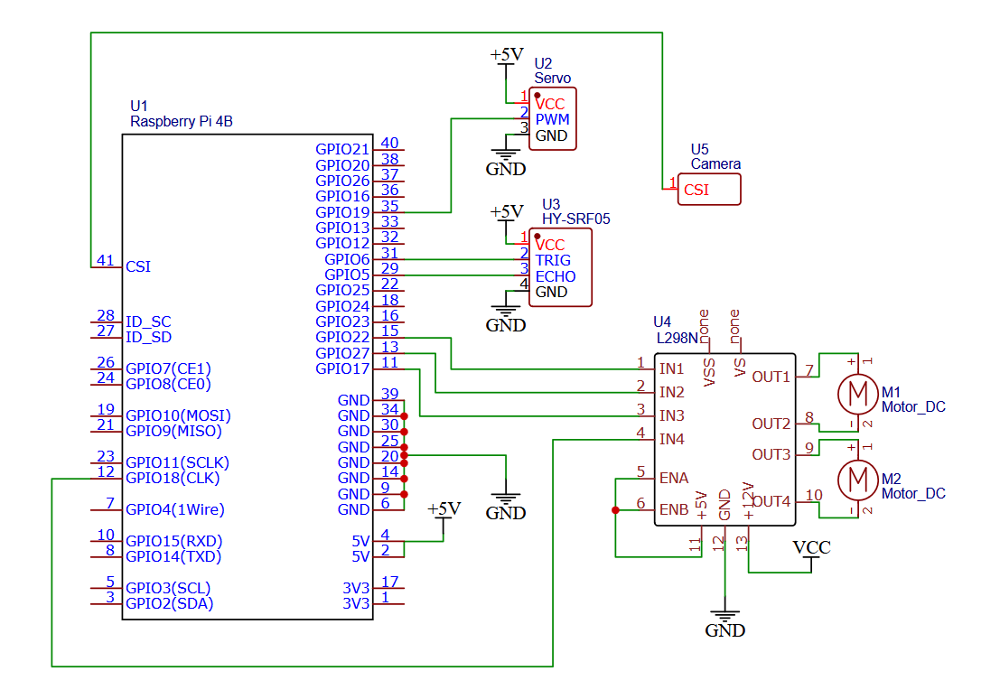

# Person following vehicle
An autonomous mobile platform designed to track and follow a specific person using computer vision and Raspberry Pi 4B.

---

## 1. Electronic circuits

  
  

---

## 2. Raspberry config

To automate the vehicle startup, you need to configure the crontab.

1. Open crontab:
   crontab -e

2. Add those two lines at the end of the file:   
    @reboot sudo pigpiod   
    @reboot python3 /home/dawid/Desktop/inz/camera_v2.py   
   
   Explanation:   
    @reboot sudo pigpiod – alternative PIN mode. PWM works through DMA (Direct Memory Access), which eliminates servo jitter.   
    @reboot python3 /home/dawid/Desktop/inz/camera_v2.py – starts the main script automatically on Raspberry Pi boot.  
